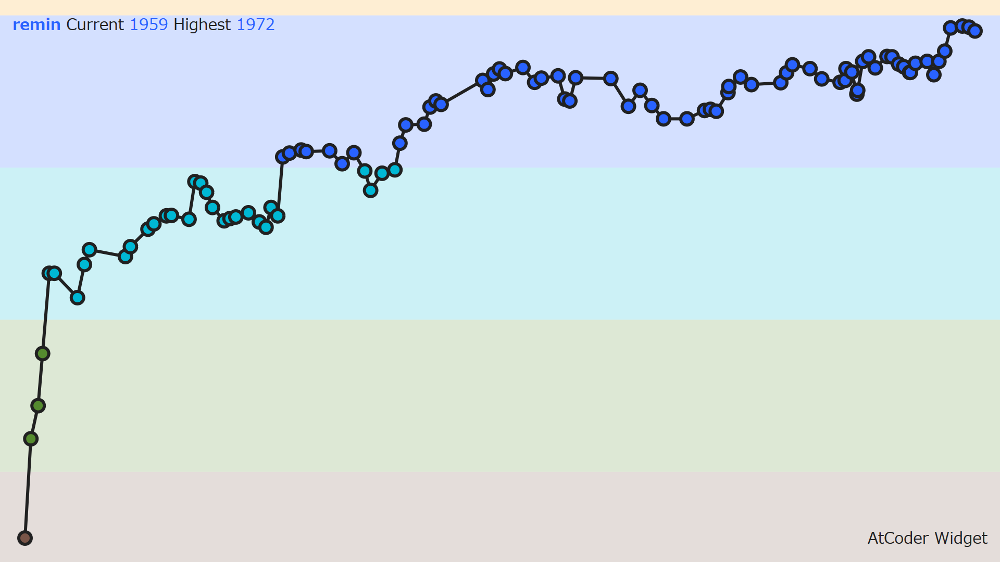

# AtCoder Widget

[![Latest NPM release][npm-badge]][npm-badge-url]
[![License][license-badge]][license-badge-url]

A web widget to embed your AtCoder rating.

AtCoder のレーティングを表示するウィジェット。



## Usage

Add the following HTML snippet to your web site.

次の HTML をウェブサイトに追加してください。

```html
<div class="atcoder-widget" data-user="your_atcoder_id">
  <script async src="https://cdn.jsdelivr.net/npm/atcoder-widget@0.0.3/dist/widget.js"></script>
</div>
```

## License

[![License][license-badge]][license-badge-url]

[npm-badge]: https://img.shields.io/npm/v/atcoder-widget.svg
[npm-badge-url]: https://www.npmjs.com/package/atcoder-widget
[license-badge]: https://img.shields.io/github/license/rdrgn/atcoder-widget
[license-badge-url]: ./LICENSE
